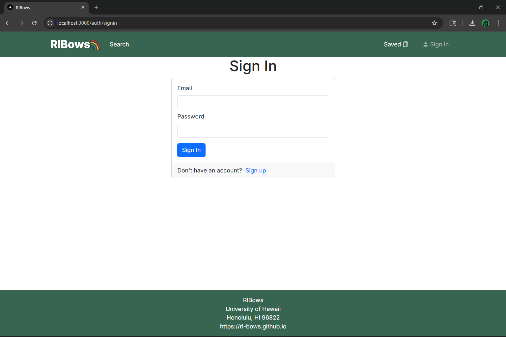

## Table of Contents
- [Description](#description)
- [Deployment](#deployment)
- [User Guide](#user-guide)
- [Community Feedback](#community-feedback)
- [Developer Guide](#developer-guide)
- [Development History](#development-history)
- [Team](#team)

## Description
RIBows is a web page built by UH students, for UH students to easily find and joi RIOs. When searching for a club, users can either browse through the most trendy RIOs, search for a specific club, or search based your hobbies and interests. 

### Goals
The high-level goal of this project is to develop a website, called RIBows, that streamlines the process of discovering, searching for, and joining Registered Independent Organizations (RIOs) at the University of Hawaii at Manoa (UH). 

We aim to, at minimum, implement the following features:
- Upload RIO data from the RIO spreadsheet
- RIO searching
- RIO filtering
- A login system
- A way to customize interests
- A way to edit your profile
- A way for RIO admins to add/edit their RIOs

For reach goals, we would like to implement:
- Interest tailored tags 
- An RIO bookmarking feature
- A form associated with each RIO that allows users to fill out their join request that either automatically sends an email to the club admin or sends a notification to the club admin's RIBows account
- A club rating system
- An expiration date system that requires club admins to renew the club every year

## Deployment
Link to the deployed application [here](https://ri-bows-5s0vi7bj3-gerrics-projects.vercel.app/)

## User Guide

This section provides a walkthrough of the RIBows user interface and its capabilities.

## Landing Page
The landing page is presented to users when they visit the top-level URL to the site.

Where they are directed to sign up and make a profile or sign in if they already have an account.

Our website will allow RIO admins to add/edit their posted RIOs in a conceptually similar way to this form.

Our website will have a page that lists all RIOs and allows users to filter and search for RIOs, similar to above.

## Community Feedback
We are interested in your experience using RIBows! If you would like, please take a couple of minutes to fill out the RIBows Feedback Form. It contains only five short questions and will help us understand how to improve the system.

## Developer Guide
Not done

## Development History

### Milestone 1: Mockup development
The goal of Milestone 1 was to create a set of HTML pages providing a mockup of the pages in the system.

Milestone 1 was managed using [RIBows GitHub Project Board M1](https://github.com/orgs/RI-Bows/projects/2):

Put screenshot of all issues done here

Milestone 2 is managed using [RIBows GitHub Project Board M2](https://github.com/orgs/RI-Bows/projects/6)

Put screenshot of all issues to be done here

## Team
RIBows is designed and implemented by Gerric Abe, Tyler Jordan Acasio, Charles Brown III, Ethan Chiu, and [Kate Hamada](https://katehamada.github.io/)

Here is the link to our [team contract](https://docs.google.com/document/d/15l0wCt8EKYHtAWk8A6nEZsd7tPoo2wtClHtCA2XVC9Y/edit?usp=sharing).
