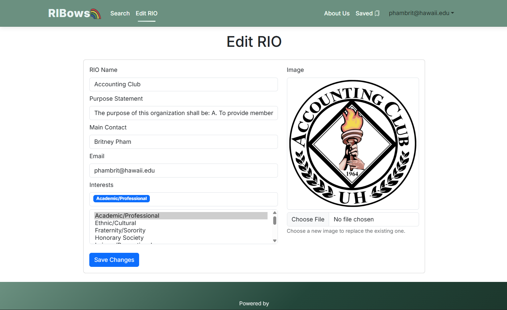

# RIBows

## Table of Contents
- [Description](#description)
- [Deployment](#deployment)
- [User Guide](#user-guide)
- [Community Feedback](#community-feedback)
- [Developer Guide](#developer-guide)
- [Development History](#development-history)
- [Team](#team)

## Overview
RIBows is a web page built by UH students, for UH students to easily find and join Registered Independent Organizations, RIOs. When searching for an RIO, users can either browse through the most trendy RIO's, search for a specific RIO's, or search based on your hobbies and interests. In addition to that users will be able to bookmark an RIO that they are thinking of joining or looks interesting but doesn't want to commit to joining just yet. Users will also be able to fill out a form to join an RIO and RIO users will be able to edit their own RIO page information.

## Deployment
Link to the deployed application [here](https://ri-bows.vercel.app/)

## User Guide
This section provides a walkthrough of the RIBows user interface and its capabilities.

### Landing Page
The landing page is presented to users when they visit the top-level URL to the site.

### Sign In / Sign UP Pages
Where they are directed to sign up and make a profile or sign in if they already have an account.

### User Tabs
Once they're logged in then they can look at the clubs that they've bookmarked:

If they just started then they can look at the Search Tab where they can search for a specific club:

 <!--- import image -->

Or they can browse the Trending tab if they don't have a particular club in mind:

 <!--- import image -->

If the user is a club account then they will be able to edit their RIO page details.

 <!--- import image -->

If the user is logged in as an admin then they are able to add RIO's in addition to edit them:

 

## Community Feedback
We are interested in your experience using RIBows! If you would like, please take a couple of minutes to fill out the [RIBows Feedback Form](FeedbackForm). It contains only five short questions and will help us understand how to improve the system.

## Developer Guide
Not done

## Development History

### Milestone 1: Mockup development
The goal of Milestone 1 was to create a set of HTML pages providing a mockup of the pages in the system.

Milestone 1 was managed using [RIBows GitHub Project Board M1](https://github.com/orgs/RI-Bows/projects/2):

Put screenshot of all issues done here

Milestone 2 is managed using [RIBows GitHub Project Board M2](https://github.com/orgs/RI-Bows/projects/6)

Put screenshot of all issues to be done here

## Team
RIBows is designed and implemented by Gerric Abe, Tyler Jordan Acasio, Charles Brown III, Ethan Chiu, and [Kate Hamada](https://katehamada.github.io/)

Here is the link to our [team contract](https://docs.google.com/document/d/15l0wCt8EKYHtAWk8A6nEZsd7tPoo2wtClHtCA2XVC9Y/edit?usp=sharing).
