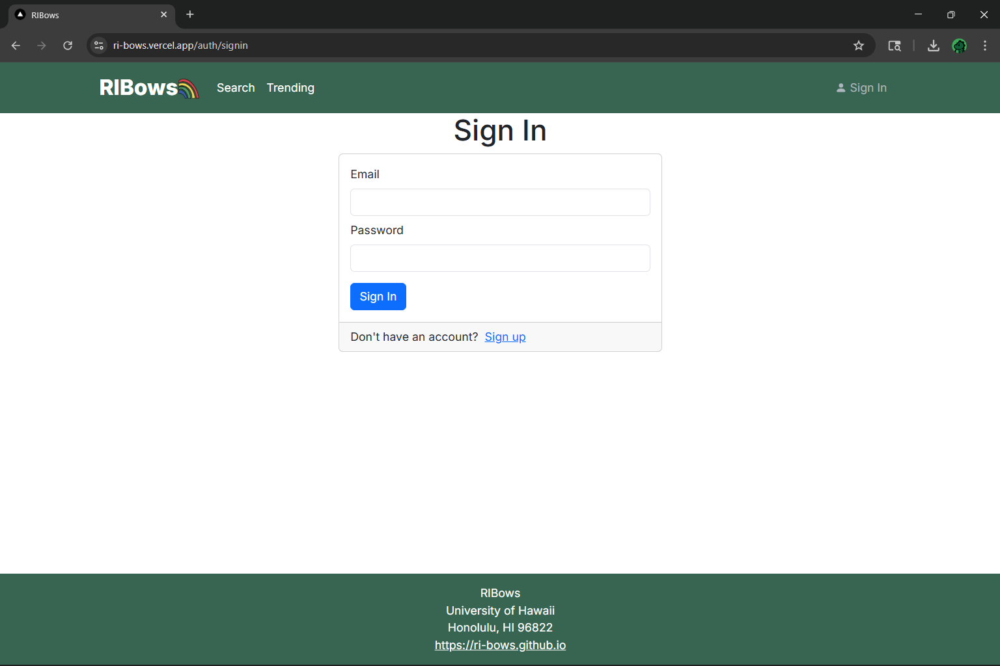
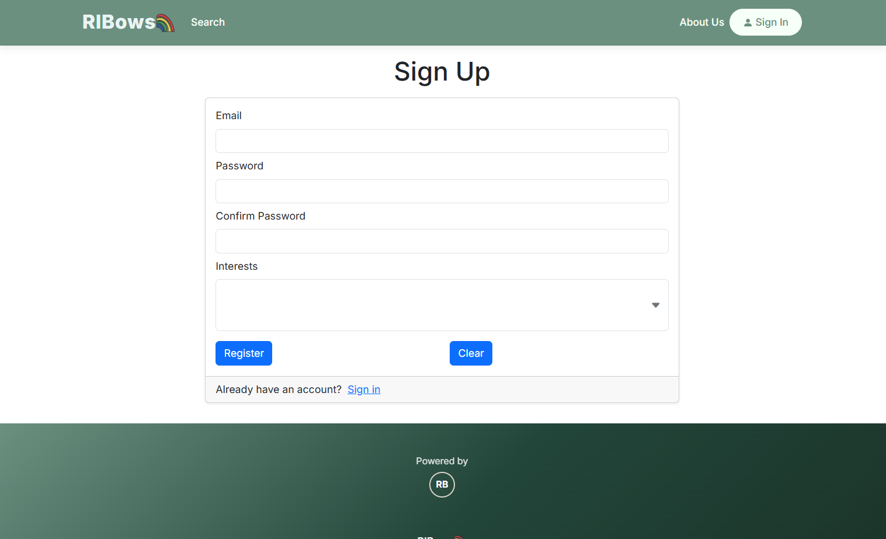
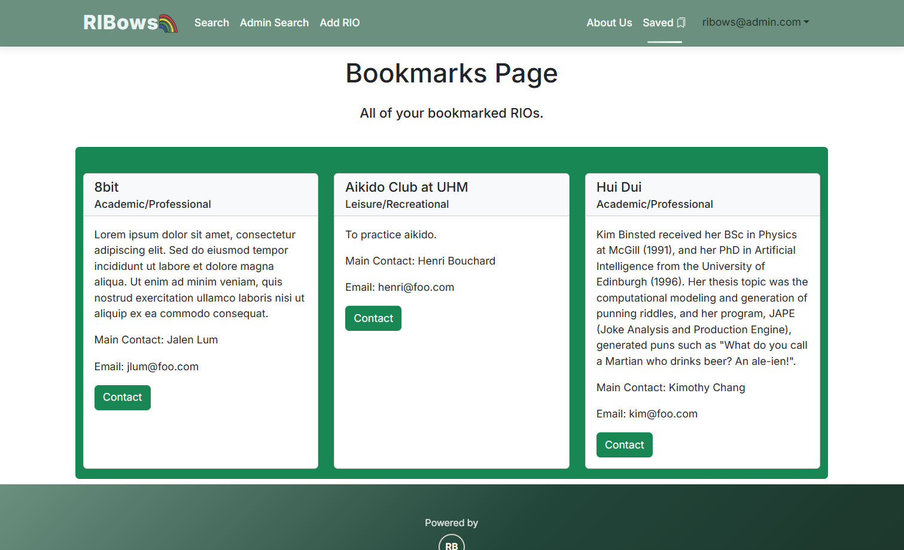
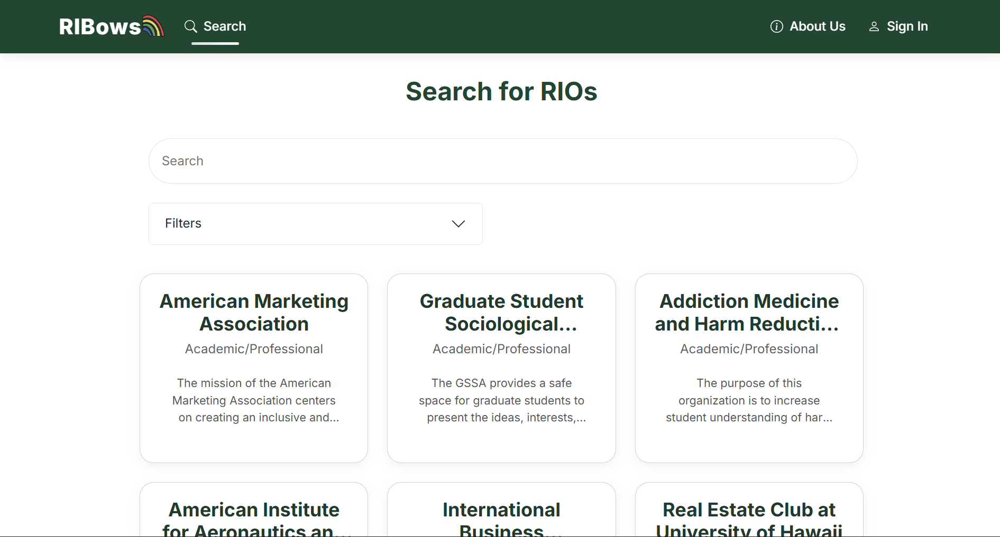
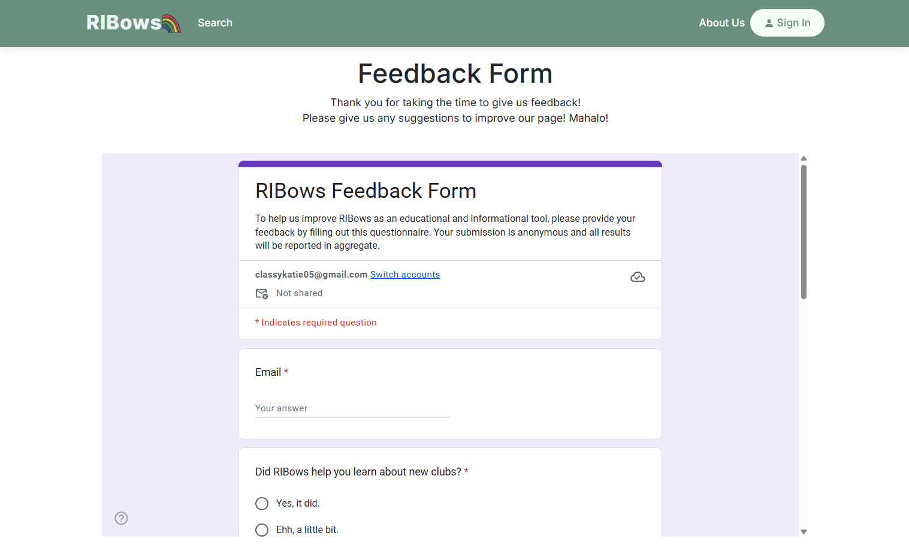
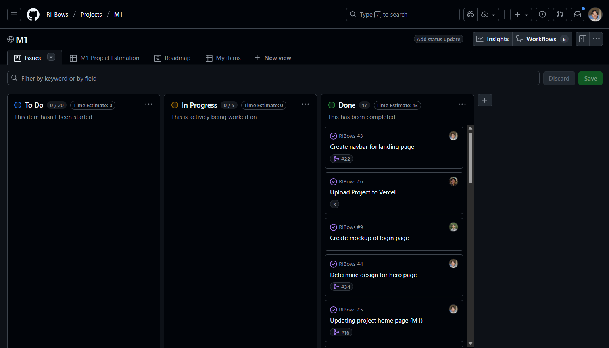
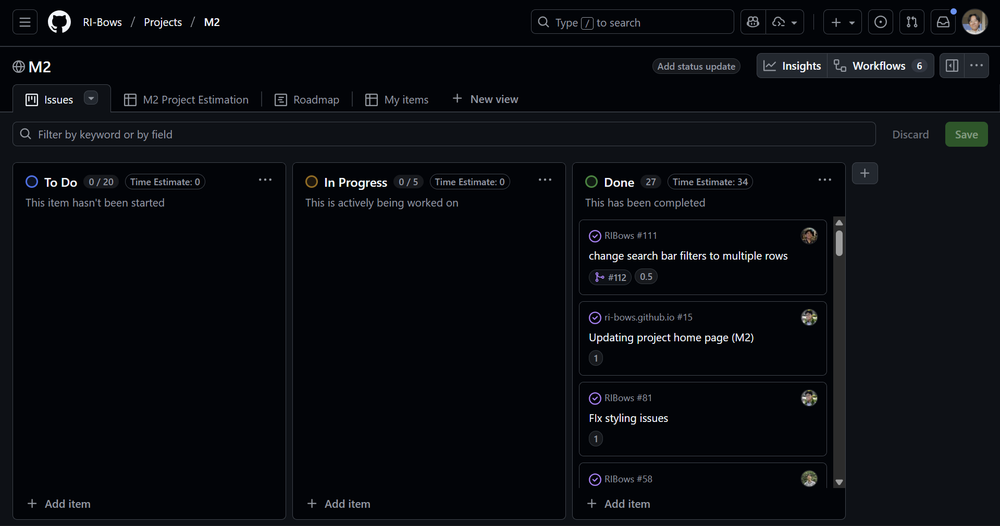

# RIBows

## Table of Contents
- [Overview](#overview)
- [Admin Features](#admin-features)
- [Deployment](#deployment)
- [User Guide](#user-guide)
- [Pages](#pages)
- [Community Feedback](#community-feedback)
- [Developer Guide](#developer-guide)
- [Development History](#development-history)
- [Team](#team)

## Overview
RIBows is a website built by University of Hawaii at Manoa (UHM) students, for UHM students, to easily search for, discover, and join Registered Independent Organizations (RIOs). RIBows gives users the flexibility to browse trending RIOs or search for specific RIOs based on interests or keywords. If a user sees an RIO that interests them, they can use the bookmarking feature to save the RIO for easy future reference. Once a user finds an RIO they want to join, simply clicking the "apply" button allows them to send an application to the RIO admin.

## Admin Features
Via an admin account, RIO admins can edit their RIO, allowing them to customize its image, description, and more. 

## Deployment
The RIBows application was deployed on Vercel through this [link](https://ri-bows.vercel.app/)

## User Guide
This section provides a walkthrough of the RIBows user interface and its capabilities.

## Pages
### Landing
The landing page is presented to users when they visit the top-level URL of the site. This page explains basic usage of the website and displays currently trending RIOs.

### Sign In / Sign Up
Users can access the sign in page via the "Sign In" button on the navbar. There, the user has the option to either sign in or create a new account.

On the sign up page, users are able to create their account and specify the types of RIOs they are interested in.

### Bookmarked
Logged in users can view RIOs they've bookmarked by pressing "Saved" on the navbar.

### Search
The "Search" page accessible from the navbar allows users to search for RIOs with keywords of their choice. Users also have the option to filter RIOs based on interests, date added, and more.

 <!--- import image -->

### Admin
If the user signs in with an admin account, they will be able to add their RIO's details from the admin page.

 <!--- import image -->

## Community Feedback
We have also added a feedback page. If the user would like, they could take a couple of minutes to fill out the [RIBows Feedback Form](FeedbackForm). The form asks for the user's email address and a text area to include feedback/improvements for our app.

## Developer Guide
WIP

## Development History

### Milestone 1: Mockup development
The goal of Milestone 1 was to create a minimal set of mockup pages to provide a skeleton for the final website. The page designs are still ongoing and most functionality has not been implemented.

Milestone 1 was managed using [RIBows GitHub Project Board M1](https://github.com/orgs/RI-Bows/projects/2):

### Milestone 2: Database implementation
The goal of Milestone 2 was to finish up the mockup pages, connect the spreadsheet of RIOs to the database, and begin to implement database functionalities.

Milestone 2 is managed using [RIBows GitHub Project Board M2](https://github.com/orgs/RI-Bows/projects/6)

## Team
RIBows is designed, implemented, and maintained by UHM students [Gerric Abe](https://g3rr1c.github.io/), [Tyler Jordan Acasio](https://tjlacasio.github.io/), [Charles Brown III](https://cbxiii.github.io/), [Ethan Chiu](https://ethnchiu.github.io/), and [Kate Hamada](https://katehamada.github.io/)

Here is the link to our [team contract](https://docs.google.com/document/d/15l0wCt8EKYHtAWk8A6nEZsd7tPoo2wtClHtCA2XVC9Y/edit?usp=sharing), which outlines criteria we adhere to to effectively work together and develop this website.
