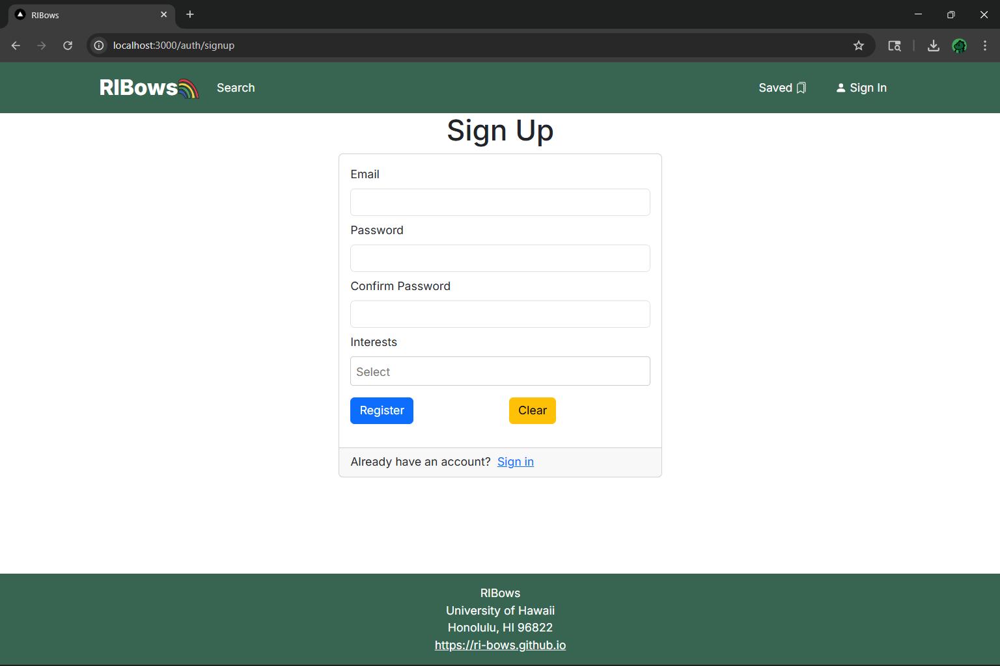
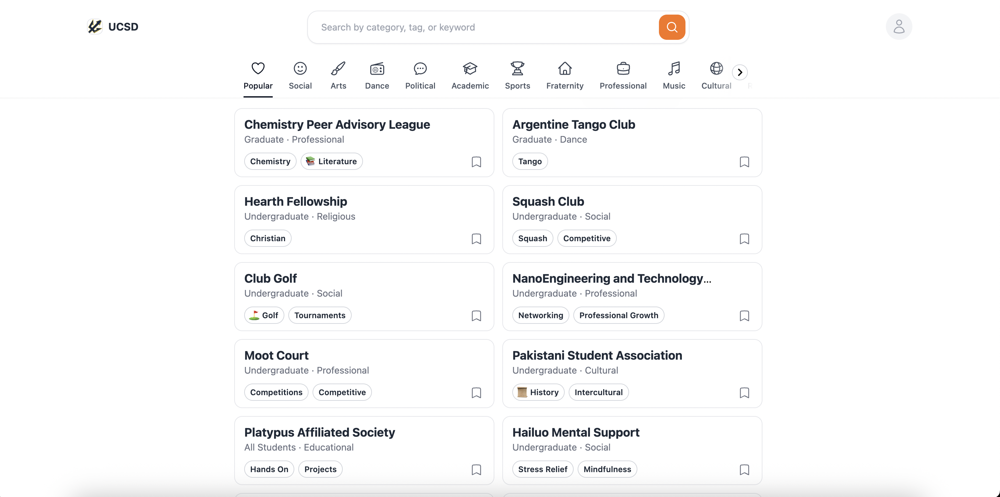

# RIBows

## Description
The high-level goal of this project is to develop a website, called RIBows, that streamlines the process of discovering, searching for, and joining Registered Independent Organizations (RIOs) at the University of Hawaii at Manoa (UH). 

We aim to, at minimum, implement the following features:
- Upload RIO data from the RIO spreadsheet
- RIO searching
- RIO filtering
- A login system
- A way to customize interests
- A way to edit your profile
- A way for RIO admins to add/edit their RIOs

For reach goals, we would like to implement:
- Interest tailored tags 
- An RIO bookmarking feature
- A form associated with each RIO that allows users to fill out their join request that either automatically sends an email to the club admin or sends a notification to the club admin's RIBows account
- A club rating system
- An expiration date system that requires club admins to renew the club every year

## Mockup Pages
The following are screenshots from templates or existing webpages that serve as inspiration for the layout of our final website:

Our website will feature a sign-up/sign-in page similar to the one found in the above screenshot.

Our website will allow RIO admins to add/edit their posted RIOs in a conceptually similar way to this form.

Our website will have a page that lists all RIOs and allows users to filter and search for RIOs, similar to above.

## Team Contract
Here is the link to our [team contract](https://docs.google.com/document/d/15l0wCt8EKYHtAWk8A6nEZsd7tPoo2wtClHtCA2XVC9Y/edit?usp=sharing).

